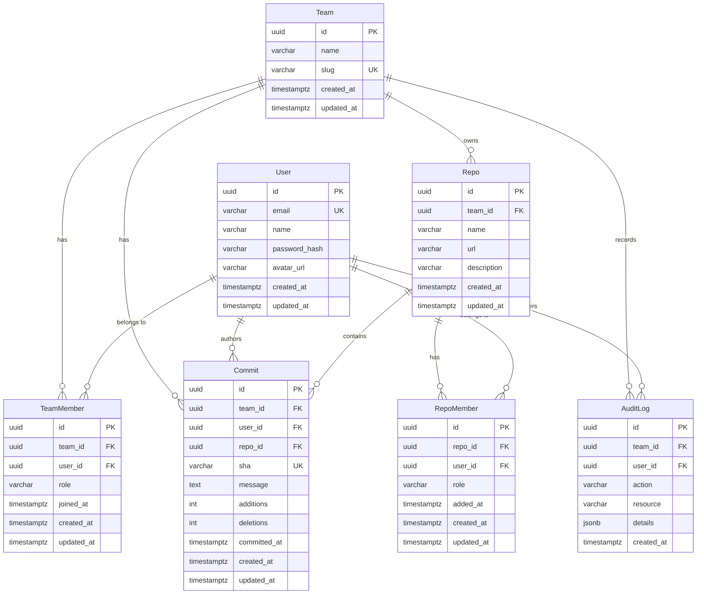

# 数据库 ERD — Smart Commit Helper 数据底座

> 本文档是 S1 阶段交付物，描述 7 张核心业务表的结构、字段和关联关系。
> 请同伴或讲师 Review 后再进入 S2 阶段。

---

## 1. ER 图（Mermaid）

---

## 2. 表结构详细说明

### 2.1 Team（团队表）

| 字段 | 类型 | 约束 | 说明 |
|------|------|------|------|
| id | UUID | PK, DEFAULT gen_random_uuid() | 团队唯一标识 |
| name | VARCHAR(100) | NOT NULL | 团队名称 |
| slug | VARCHAR(100) | NOT NULL, UNIQUE | URL 友好的团队标识 |
| created_at | TIMESTAMPTZ | NOT NULL, DEFAULT now() | 创建时间 |
| updated_at | TIMESTAMPTZ | NOT NULL, DEFAULT now() | 更新时间 |

**说明**：团队是多租户隔离的顶层实体。Team 表自身不需要 `team_id` 字段。

---

### 2.2 User（用户表）

| 字段 | 类型 | 约束 | 说明 |
|------|------|------|------|
| id | UUID | PK, DEFAULT gen_random_uuid() | 用户唯一标识 |
| email | VARCHAR(255) | NOT NULL, UNIQUE | 登录邮箱 |
| name | VARCHAR(100) | NOT NULL | 用户姓名 |
| password_hash | VARCHAR(255) | NOT NULL | 密码哈希（**MCP 无权查询**） |
| avatar_url | VARCHAR(500) | NULL | 头像 URL |
| created_at | TIMESTAMPTZ | NOT NULL, DEFAULT now() | 创建时间 |
| updated_at | TIMESTAMPTZ | NOT NULL, DEFAULT now() | 更新时间 |

**说明**：
- User 与 Team 是**多对多关系**，通过 TeamMember 中间表关联。
- `password_hash` 是敏感字段，MCP 只读账号无权查询。

---

### 2.3 TeamMember（团队成员中间表）

| 字段 | 类型 | 约束 | 说明 |
|------|------|------|------|
| id | UUID | PK, DEFAULT gen_random_uuid() | 记录唯一标识 |
| team_id | UUID | FK → Team.id, NOT NULL, **INDEX** | 所属团队 |
| user_id | UUID | FK → User.id, NOT NULL, **INDEX** | 所属用户 |
| role | VARCHAR(50) | NOT NULL, DEFAULT 'member' | 团队角色（owner / admin / member） |
| joined_at | TIMESTAMPTZ | NOT NULL, DEFAULT now() | 加入时间 |
| created_at | TIMESTAMPTZ | NOT NULL, DEFAULT now() | 创建时间 |
| updated_at | TIMESTAMPTZ | NOT NULL, DEFAULT now() | 更新时间 |

**约束**：
- UNIQUE(team_id, user_id) — 同一用户在同一团队只能有一条记录。

**说明**：
- 这是 Team 和 User 之间的**多对多中间表**。
- 带元数据：`role`（角色）、`joined_at`（加入时间）。
- `team_id` 和 `user_id` 均建索引，支持双向反查。

---

### 2.4 Repo（代码仓库表）

| 字段 | 类型 | 约束 | 说明 |
|------|------|------|------|
| id | UUID | PK, DEFAULT gen_random_uuid() | 仓库唯一标识 |
| team_id | UUID | FK → Team.id, NOT NULL, **INDEX** | 所属团队 |
| name | VARCHAR(200) | NOT NULL | 仓库名称 |
| url | VARCHAR(500) | NOT NULL | 仓库 URL |
| description | TEXT | NULL | 仓库描述 |
| created_at | TIMESTAMPTZ | NOT NULL, DEFAULT now() | 创建时间 |
| updated_at | TIMESTAMPTZ | NOT NULL, DEFAULT now() | 更新时间 |

**说明**：
- Repo 属于 Team（多对一），带 `team_id` 实现多租户隔离。
- Repo 与 User 通过 RepoMember 中间表关联。

---

### 2.5 RepoMember（仓库成员中间表）

| 字段 | 类型 | 约束 | 说明 |
|------|------|------|------|
| id | UUID | PK, DEFAULT gen_random_uuid() | 记录唯一标识 |
| repo_id | UUID | FK → Repo.id, NOT NULL, **INDEX** | 所属仓库 |
| user_id | UUID | FK → User.id, NOT NULL, **INDEX** | 所属用户 |
| role | VARCHAR(50) | NOT NULL, DEFAULT 'developer' | 仓库角色（maintainer / developer / viewer） |
| added_at | TIMESTAMPTZ | NOT NULL, DEFAULT now() | 添加时间 |
| created_at | TIMESTAMPTZ | NOT NULL, DEFAULT now() | 创建时间 |
| updated_at | TIMESTAMPTZ | NOT NULL, DEFAULT now() | 更新时间 |

**约束**：
- UNIQUE(repo_id, user_id) — 同一用户在同一仓库只能有一条记录。

**说明**：
- 这是 Repo 和 User 之间的**多对多中间表**。
- 带元数据：`role`（角色）、`added_at`（添加时间）。
- `repo_id` 和 `user_id` 均建索引。

---

### 2.6 Commit（代码提交表）

| 字段 | 类型 | 约束 | 说明 |
|------|------|------|------|
| id | UUID | PK, DEFAULT gen_random_uuid() | 提交唯一标识 |
| team_id | UUID | FK → Team.id, NOT NULL, **INDEX** | 所属团队（多租户隔离） |
| user_id | UUID | FK → User.id, NOT NULL, **INDEX** | 提交作者 |
| repo_id | UUID | FK → Repo.id, NOT NULL, **INDEX** | 所属仓库 |
| sha | VARCHAR(40) | NOT NULL, UNIQUE | Git commit SHA |
| message | TEXT | NOT NULL | 提交信息 |
| additions | INTEGER | NOT NULL, DEFAULT 0 | 新增行数 |
| deletions | INTEGER | NOT NULL, DEFAULT 0 | 删除行数 |
| committed_at | TIMESTAMPTZ | NOT NULL | 提交时间 |
| created_at | TIMESTAMPTZ | NOT NULL, DEFAULT now() | 记录创建时间 |
| updated_at | TIMESTAMPTZ | NOT NULL, DEFAULT now() | 记录更新时间 |

**说明**：
- Commit 同时关联 Team、User、Repo，三个外键均建索引。
- `team_id` 用于多租户隔离，确保团队只能查到自己的提交。
- `sha` 唯一约束防止重复导入同一提交。

---

### 2.7 AuditLog（审计日志表）

| 字段 | 类型 | 约束 | 说明 |
|------|------|------|------|
| id | UUID | PK, DEFAULT gen_random_uuid() | 日志唯一标识 |
| team_id | UUID | FK → Team.id, NOT NULL, **INDEX** | 所属团队 |
| user_id | UUID | FK → User.id, NOT NULL, **INDEX** | 操作人 |
| action | VARCHAR(100) | NOT NULL | 操作类型（如 create_member / delete_commit） |
| resource | VARCHAR(100) | NOT NULL | 操作资源类型 |
| details | JSONB | NULL | 操作详情（灵活存储） |
| created_at | TIMESTAMPTZ | NOT NULL, DEFAULT now() | 操作时间 |

**说明**：
- AuditLog 只追加不修改，因此没有 `updated_at`。
- `details` 使用 JSONB 类型，灵活存储不同操作的上下文信息。
- `team_id` 和 `user_id` 均建索引，支持按团队和按用户查询审计记录。

---

## 3. 关系总结

| 关系 | 类型 | 中间表 | 元数据 |
|------|------|--------|--------|
| Team ↔ User | 多对多 | TeamMember | role, joined_at |
| Repo ↔ User | 多对多 | RepoMember | role, added_at |
| Team → Repo | 一对多 | — | — |
| Team → Commit | 一对多 | — | — |
| User → Commit | 一对多 | — | — |
| Repo → Commit | 一对多 | — | — |
| Team → AuditLog | 一对多 | — | — |
| User → AuditLog | 一对多 | — | — |

---

## 4. 多租户隔离说明

- **Team 表**：顶层实体，不需要 `team_id`。
- **User 表**：用户是跨团队的全局实体，不直接带 `team_id`，通过 TeamMember 关联团队。
- **TeamMember 表**：带 `team_id`，是多租户隔离的核心关联表。
- **Repo 表**：带 `team_id`，仓库属于特定团队。
- **RepoMember 表**：通过 repo_id → Repo.team_id 间接实现团队隔离。
- **Commit 表**：直接带 `team_id`，查询时必须过滤。
- **AuditLog 表**：直接带 `team_id`，查询时必须过滤。

**所有业务查询必须带 `team_id` 过滤条件，绝不允许跨团队数据泄露。**

---

## 5. 索引清单

| 表 | 索引字段 | 用途 |
|----|----------|------|
| Team | slug (UNIQUE) | 按 slug 查团队 |
| User | email (UNIQUE) | 登录查询 |
| TeamMember | team_id | 查团队所有成员 |
| TeamMember | user_id | 查用户加入的所有团队 |
| TeamMember | (team_id, user_id) UNIQUE | 防重复 |
| Repo | team_id | 查团队所有仓库 |
| RepoMember | repo_id | 查仓库所有成员 |
| RepoMember | user_id | 查用户参与的所有仓库 |
| RepoMember | (repo_id, user_id) UNIQUE | 防重复 |
| Commit | team_id | 按团队查提交 |
| Commit | user_id | 按用户查提交 |
| Commit | repo_id | 按仓库查提交 |
| Commit | sha (UNIQUE) | 防重复导入 |
| AuditLog | team_id | 按团队查审计日志 |
| AuditLog | user_id | 按用户查审计日志 |

---

## 6. MCP 敏感字段

以下字段 MCP 只读账号**无权查询**：

| 表 | 字段 | 原因 |
|----|------|------|
| User | password_hash | 用户密码哈希，绝对禁止暴露 |

> 如果未来新增 secret、token、api_key 等字段，同样需要加入此清单。